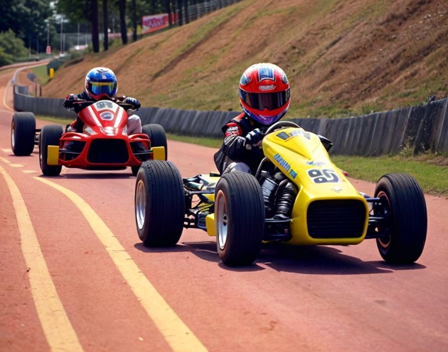

# Welcome to GTR2 Story Mode 

[Click here to get ready](./Requirements_n_setup.md)
  
[Click here to start](./1229.md)
--------------------------------
The scene is '98.

You (obviously) got a thing for fast motors, spent your whole youth thrashing about with your mates at the local go-Kart Track.

Your blower blares, it's Richard, one of your Karting mates.

"I...won't be back...for a while. Check your postbox...left you something...do what you want. It's no use to me now anyways." The bloke could barely talk, probably not listening to your questions. Then he cuts the line and, by the sounds of it, torched his phone, 'cause there's no chance of reaching him.

Ah, good old Richard, always a bit dodgy! Dodgy as in skipping town in a hurry, and somehow fancying you, 'cause he left an envelope with a set of car keys and an address. You rock up there and peel back the nylon cloth: it's a Mini Cooper S 1275!

Loads of thoughts swarm your noggin. Is there a catch? Will the motor fire up? Since when did Richard drive a classic? Does the motor have anything to do with Rich scarpering?

You hop in, crank it up... It's alive!

You're proper gobsmacked by your luck. Then you settle down, get your head straight, and start weighing up the options.

This thing's probably worth a pretty penny, maybe you could flog it and bag something cheaper. A quick scroll through the web reveals it'd be a savvy move, vintage motors are fetching more cash by the minute. But then again, what if Richard comes back and wants his motor back? Better hold off a couple months before flogging it, maybe even score more dosh.

As you rummage for the service records in the glove box, you stumble upon another booklet.

Seems Richard the Great (that's what you've dubbed him now) had signed the motor up for some Championship. Never let on he was such a pro...but then again, he didn't chat much, and we're all pondering why he had to vanish.

But hold up, there's more! The papers are for a Championship that ain't kicked off yet. There's a number on the booklet. Bloke on the line's fuming, "So you're not showing up? Remember: no refunds." Seems the whole entry and fees were paid upfront.

Could take the motor out for a spin yourself, right?

Then you start thinking downbeat like usual: people might give you the side-eye, figure something's off, start prying about the owner... and probably push you harder than Albon in a RedBull F1 car. You (or your ego) might take a hit.

So, what's the call? Pick:

..................................................................
- [I reckon I should sell the motor. Richard said I could do what I wanted with it, right?](./14045.md)

Your dreams are busted.

Three months after taking that decision, you meet someone, marry, get kids, and by the time you are 45 all you are left is the feeling of what you could have done.
..................................................................
- [Let's do this! Once dreamed I was the next Max Verstappen, gotta mean something, yeah?](./10871.md)
------------------------------------------
Well done on turning a profit from a mate's misfortune with the local Mob!

You're buzzing, can't wait for the first race weekend to roll in. You've scrutinized your motor inside-out a thousand times, driven to different tracks countless times... you've just discovered that racing pumps life into your veins! You're so fixated on the whole deal that you start panicking because your second year hasn't been paid for! And the package you're about to dive into isn't exactly budget-friendly.

What were you thinking? No proper racer would compete for just one year and then vanish! Now you're cursing your ex-friend for not coughing up for a second year in advance. Brilliant! You'll either have to sell your soul to the Devil or snag a sponsor if you want to keep racing next year.

Alright, let's take a deep breath and stop whinging, need to focus on this year's race calendar for now.

The championship runs on the same tracks and days as the official BTCC:

    13 April Thruxton
    26 April Silverstone
    04 May Donington
    17 May Brands Hatch
    25 May Oulton Park
    14 June Donington
    28 June Croft
    26 July Snetterton
    02 August Thruxton
    16 August Knockhill
    31 August Brands Hatch
    13 September Oulton Park
    20 September Silverstone

But before the season kicks off, you reckon it might be wise to get some assistance. Your mate Tom's more of a car nut than you'll ever be. Then again, he might be green-eyed that you've landed Rich's riches.

What's the call?

- TODO: this needs a different path: Otherwise, jump into GTR2 and dive into the Championship named "Straightaway," then swing back and [click here once (if) you clinch first place in the championship.](./1050.md)
- [Click here if you ring up Tom for a hand](./19126.md)
-------------------------------------------------

Alright mate, you lucky bugger, how'd you land a catch like that? Nevermind, forget I asked, probably an older lady or something.

Anyway, what matters now is you've pulled a sick move calling me up.

Let's get going with the basics, have you taken that car out for a spin yet? Ah, no, you said you just got it... You definitely need to get some miles on it before the Championship kicks off.

Good thing I know some folks who've got a secret track, perfect for beginners. And if you do well there, maybe you could even strut your stuff at Goodwood.

But remember, everything comes with a price: You let me be your race engineer for the whole season AND I get to take the car for a spin whenever I feel like it.

[Deal?](./61320.md)
-------------------------------
Welcome to High Speed Ring

This mega-secret track has a bit of history, but it's all in the virtual realm. We're all virtual after all, aren't we?

You'll learn the most crucial thing when driving a slow car fast: maintaining momentum. That means minimizing braking as much as possible and maximizing your turn exits to avoid excessive friction that slows the car down.

You should probably also try your hand at two techniques:
- Trail braking (https://www.youtube.com/watch?v=tvcuGoVhpxw)
- Use the whole track
- Look way ahead

Now, onto the track itself...

Turn 1 - right: 

    No brakes needed, maybe ease off the gas on exit to avoid overshooting, depending on your setup.
  
Turn 2 - right: 

    Tighter, so ease off the gas, maybe downshift. Watch your exit.
  
Turns 3, 4 - S-bend after the bridge: 

    Only spot where you'll need to brake. Start braking just after the bridge ends, hug the apex, then aim for a late apex on the left turn. Mind not to run wide entering the tunnel.
  
Turn 5 - right: 

    Just lift slightly to prevent overshooting on exit.

Given the track layout and the limitations of the Mini, your setup should aim to have just the fuel you need, find a brake balance you're comfortable with, and perhaps experiment with tire pressures.

One more thing: You'll find I'm quite particular about brake temperatures. Whenever I ask, just make sure they stay below 500 degrees. Even if I scream.

Now, dive into the championship named "HSR test", and then [click here when you are done, regardless of how it goes, to have a go at Goodwood](./2877.md)
-------------------------------
Your car's a gem, did you clock that? That's why those fancy collectors let us tear up some laps here at Goodwood. Bet you'll start hearing offers before we even head home.

Here's the scoop on running a lap at Goodwood in plain English:

Turn 1 – Madgwick:

    Start on the left side of the track, brake gently along the edge or don't brake at all.
    As you turn, focus on carrying speed through the bend.
    Aim for two apex points, adjusting your line depending on your car's setup.
    After the bend, keep left in the dry, center in the wet along the straight.

Turn 2 – Fordwater:

    Turn from the left side, smoothly steering due to high speed.
    In the wet, avoid a puddle on the apex by running wide.
    After the turn, let the car drift to the left, keeping on power and left for stability.

Turn 3 - St Mary’s:

    Brake gently before the slight crest, aiming for the right apex.
    Get back on the power early, moving to the middle of the track for exit.
    Brake short and firm for St Mary's part two, aiming for the apex on the right.

Turn 4 - Lavant:

    Brake halfway between the brake and 50 board, aiming for the apex.
    Start power after the first apex, avoiding painted kerbs in the wet.
    Unwind steering and run fully left next to the green arrow board.

Turn 5 - Kink:

    Smoothly move right, using boards to guide through the kink.
    Aim for the number 50 board for braking into Woodcote corner.

Turn 6 – Woodcote:

    Brake at the 200 or brake board, easing off to keep left.
    Add more lock at the second red chevron for the apex on the right.
    Stay on power in third gear up to the chicane braking point.

Turn 7 – Chicane:

    Brake short and firm, choosing a late or early turn into the chicane.
    Unwind steering after the left wall, feeding in power progressively along the right side of the track.

In terms of setup, the same as on High Speed Ring should be a good base, but you have to play with it and find out.
    
- [Click here when you're done, regardless of your result.](./xxxx.md)
-------------------------------------------------------
Now, this is where the real deal kicks in... still game?

If you jump into the championship and mess up the car, you're in deep trouble. And let's face it, you don't even know where the car came from. 

But if you're game, once you're finished testing at Goodwood, no matter how it goes, dive into GTR2 and kickstart the Championship named "". 
- [Click here when you're done, and if (big if) you manage to bag first place in the championship.](./1050.md)
- -----------------------------------------------------

1999. You smashed your first Championship!

Nah, scratch that, you absolutely bossed it and took home the win. And guess what? You're still alive and kicking.

Plus, you've landed yourself a Personal Sponsor, Mister Super Star!

Listen up, mate: This second year might see you hitting up some European Tracks.

Now, about this CheDr Ltd. After a bit of online snooping, it looks like they might be a bit dodgy, maybe even mixed up in some shady business. But hey, the season's already paid for, and it's not that different from last year, right?

But as you slip back into your usual panic mode, you start to wonder if there's a link between Richard's disappearance and CheDr. Maybe they've got some hidden agenda, and that's why they're throwing money at your hobby. 'Cause let's be real, why else would they invest in someone who's not Hamilton or Stroll?

And here's the twist: Your Sponsor isn't just keen on this Mini championship, they're eyeing up a new Touring Car championship starting next year.

So yeah, you'll be juggling races and proving yourself in a new ride.

It's a sweet problem to have, but it'll eat up all your time, leaving zilch for other gigs, hobbies, or chilling with mates.

Again, it's on you:

- Click here to switch your Instagram profile to "former race champion".
- [Click here to keep getting down and dirty in the races.](./14963.md)
------------------------------------------------------
You tend to be a realistic guy, and so you take a year off your job to become a semi-professional race driver, because of course you do!

This year's race calendar looks as follows:

-------------------------------------------------------

Junio 2002, recibes una llamada un Jueves por la tarde. El piloto titular de tu patrocinador en otro campeonato se ha lesionado de gravedad.

Hasta ahora pensabas que eras un tipo con suerte, pero después de esto deberías invertir en Bitcoin.

Viajas ese mismo día a la primera carrera, con el tiempo justo de vestirte para la primera partica de la primera carrera del anho en la copa M3

