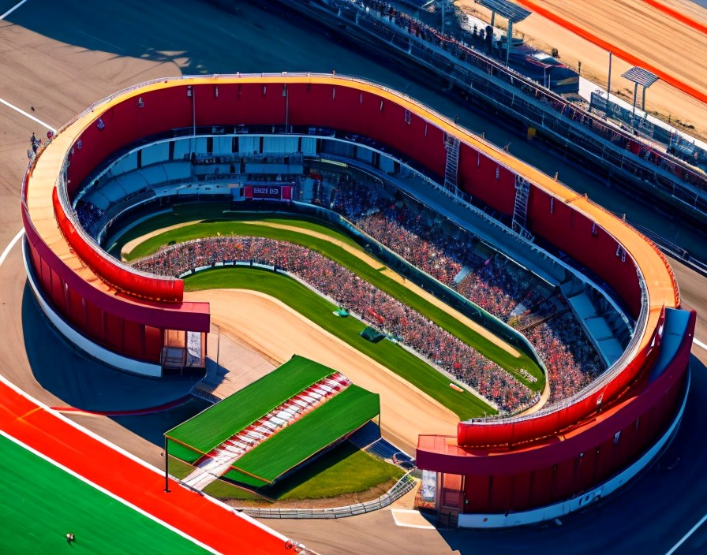

# First blood at the High Speed Ring

That night, Marco could barely sleep, in part because he had already kicked himself out several times that day, but mostly because he had quite a lot to think about. 
He still had not mastered this new skill or understood how the system worked. He had noticed time did not progress at the same pace on Max's "universe" and very bravely decided not to care about what he cannot control.

He tapped himself in the back for this and, as if intoxicated by this newly discovered courage, he went completely out of his way to decide he actually wanted a piece of that racing car adventure.
If you write your will, and then your behavior changes so much and so suddenly, your new 40-year younger, out-of-your-league spouse is legally left with nothing, but Marco's head had stopped looking at facts or statistics, which allowed the rest of his body dance naked to the tunes of "fuck it".

Back to Tom, and Marco got what everyone on a very exciting journey invariably gets first: hours of boring preparation. This was Marco though, and he really was enjoying the details:

    This track's got a bit of history, virtual history, but aren't we all virtual in a way?  
    Right, let's get into the nitty-gritty of driving a slow car fast: momentum.   
    That means braking as little as possible and maximizing your turn exits to avoid dragging the motor down.  

    You'll also want to try your hand at some key techniques. To get the most out of it, focus on nailing one thing at a time until it's second nature:

    First off, consistency.  
    Aim for at least 15 laps before pitting again.
    Warm up your tires and improve your lap times gradually as the fuel runs down.
    Try to keep your lap times consistent over 5-6 laps (they don't need to be lightning fast).

    When you got consistent, then try to get faster by making the most of the whole track.
    Make sure you're hugging the outer edge before a turn, then swing back out to make the turn as wide as can be.
    Use visual cues to see how close you are to the track edge.
    Use the feedback from your steering wheel to see if your wheels are off the track (if your wheel supports that, like).

    Once you build an instinct for where the car is positioned, partice looking ahead.
    Check out this video (preferably on DVD for historical accuracy) for some tips:
    - https://youtu.be/WO-URMCm7SI?t=60
     
    If you want some extra points on your first experience, give trail braking a try.
    Watch these videos for pointers:
    - https://www.youtube.com/watch?v=tvcuGoVhpxw
    - https://www.youtube.com/watch?v=eUdaWbr1KB4
    - https://www.youtube.com/watch?v=hxIanjfmGDY

    Last but not least, remember that the Mini is a FWD car, so maybe have a look at this video about that kind of cars:
    - https://www.youtube.com/watch?v=8jys4hEKfhM

Marco noticed that Tom was offering videos that were yet to be created, but watched them anyways.

     Now, let's tackle the track itself...

    Turn 1 - right:
    No need for brakes; maybe just ease off the gas a bit on exit to prevent overshooting, depending on your setup.

    Turn 2 - right:
    Bit tighter; ease off the gas, maybe drop a gear. Keep an eye on your exit.

    Turns 3 and 4 - S-bend after the bridge:
    Braking just after the bridge ends. Hug the apex, then aim for a late apex on the left turn.
    This is prime time to practice using the full track and trail braking.
    Be careful not to run wide when you're entering the tunnel.

    Turn 5 - right:
    Just lift off the gas a bit to prevent overshooting on exit.

Being a newbie on this track with the Mini, you decide not to touch much and focus your setup on only loading only as little gas as you need, finding a comfortable brake balance, and perhaps experimenting with tire pressures, but you still have a look at some videos about setting up FWD cars to understand the big picture: https://www.youtube.com/watch?v=uADTsFrv4YE.

When the day arrives, you literally slept 3 hours maximum. There is no pressure for results, but it is your first time on a race track and you know there is a lot of basic stuff you will be learning.

[Continue...](004.md)  
