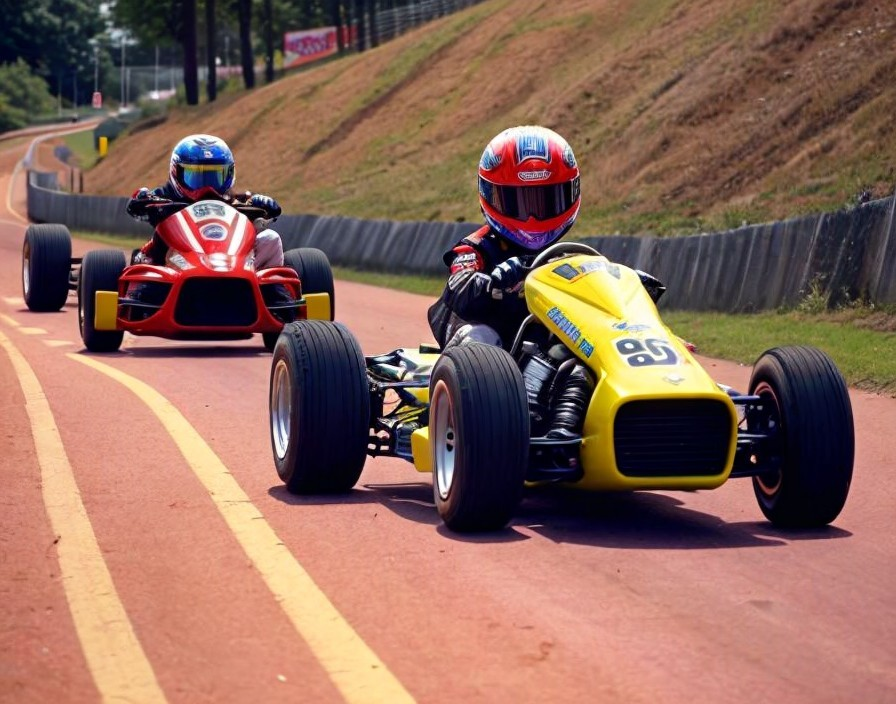
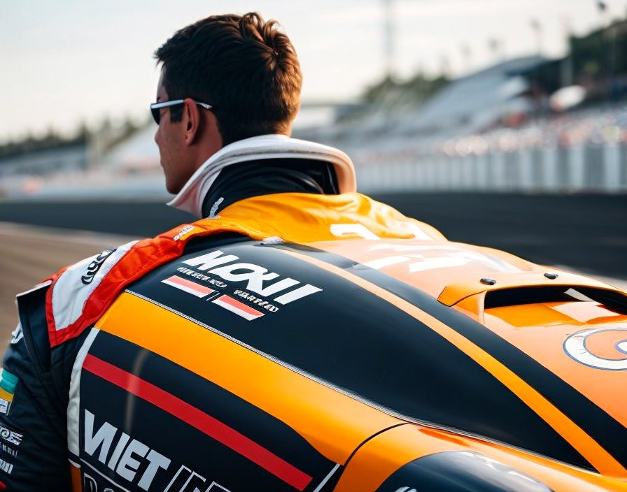
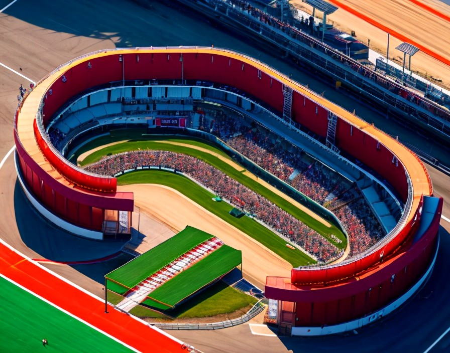

# Episode 1

The year is 1999.

Your phone rings loudly, and it's Richard, one of your karting buddies.

"Check your mailbox... I left you something... do as you please with it." His speech is strained, and he seems unwilling to engage with your inquiries. He abruptly ends the call, leaving you with the sense that he's gone.

Ah, Richard, always a bit enigmatic! He chooses to vanish, leaving behind an envelope containing a set of car keys and an address. You arrive at the location and confirm that under a cloth cover there is indeed a car, and not just any car, but a vintage Mini Cooper!

Numerous thoughts race through your mind. Is there a catch? Will the car start? Since when did Richard possess a classic car? Eager to confirm your gut feeling, you try to call him, but the number is no longer reachable.

You slide into the driver's seat, look around, and discover the car is actually race-prepped. You turn the key and confirm the engine's roar is far too loud for city streets. What a sound!

You drive to Rich's place, torn between not wanting to be the noisy neighbor and yearning to hear that engine roar. There is nobody at home. Could it really be that Rich is completely gone? You're struck by your stroke of luck. However, practical considerations soon come into play, prompting you to weigh your options.

The car could fetch a substantial sum if sold, enabling you to acquire something more economical. A brief online search confirms the escalating value of vintage cars. Yet, you hesitate, unsure of Richard's potential return. Perhaps it's wise to delay any decisions.

As you sift through the glove box for service records, you make another discovery.

It appears Richard had entered the car into a championship. Who would have guessed he harbored such aspirations? Nonetheless, Richard always kept to himself, leaving others to speculate about his secrets.

Moreover, the paperwork indicates that the championship has yet to commence, with a provided contact number. The individual on the other end sounds annoyed, reminding you that no refunds are available for non-attendance.

Could this present an opportunity for you to participate in the championship? Rich told you to do as you please with the car, so you could give it a try, and if he changes his mind and shows up, you can simply hand him the keys.

However, doubts begin to creep in. The car is likely registered in Rich's name, might people suspect something is awry? The prospect of scrutiny and potential judgment starts to weigh heavily on your mind. What if the car has something to do with Rich's disappearance? Would you also have to disappear?

------------------------------------------
Excitement mingles with apprehension as you contemplate the daunting challenge ahead.

You see, you are no seasoned racer. In fact, you have never even set foot on a racing track other than your local go-Kart ring before. 
The idea of competing against seasoned veterans in a high-stakes championship seems both exhilarating and terrifying.

But also know that this opportunity is too precious to pass up. With a determined glint in your eye, you make a decision.

Rather than diving headfirst into the championship without any experience, you resolve to hone your skills first. It may be a good idea to give the most seasoned guy from your go-karting days, Tom, a call. You also decide to not tell him about the whole Rich story.

    Ah, you've struck gold, mate! How on earth did you manage to nab such an opportunity? 
    Never mind, I probably don't want to know – likely involves a story with an older lady or something equally wild.

    But hey, let's focus! What's important now is that you've called me up. Let's get down to business and start with the basics. 

    Have you had a chance to take that car out for a spin yet? Oh, wait, you just got it, didn't you? 
    Well, no worries, mate, we'll need to rack up some miles before the Championship kicks off anyway.

    I happen to know a few lads who've got access to a nice track – perfect for newbies like yourself, and if you impress there, who knows? Maybe you'll be strutting your stuff at Goodwood before you know it.

    But, you know the deal – nothing comes for free. 
    I want to be your race engineer for the entire season, and trust me, you'll want my expertise, so I'll need the odd joyride in that motor when the mood strikes me.

------------------------------------------
    Now, onto the High Speed Ring.

    This track's got a bit of history, even if it's all in the virtual realm. But hey, aren't we all virtual in a way?

    Right, let's get into the nitty-gritty of driving a slow car fast: momentum. That means braking as little as possible and maximizing your turn exits to avoid dragging the motor down.

    You'll want to try your hand at some key techniques. To get the most out of it, focus on nailing one thing at a time until it's second nature:

    First off, consistency.
        Aim for at least 15 laps before pitting again.
        Warm up your tires and improve your lap times gradually as the fuel runs down.
        Try to keep your lap times consistent over 5-6 laps (they don't need to be lightning fast).
    Make the most of the whole track.
        Make sure you're hugging the outer edge before a turn, then swing back out to make the turn as wide as can be.
        Use visual cues to see how close you are to the track edge.
        Use the feedback from your steering wheel to see if your wheels are off the track (if your wheel supports that, like).
    Look ahead.
        Check out this video for some tips: [link to video].
    Get practicing with trail braking.
        Watch these videos for pointers: [links to videos].

    Now, let's tackle the track itself...

    Turn 1 - right:
    No need for brakes; maybe just ease off the gas a bit on exit to prevent overshooting, depending on your setup.

    Turn 2 - right:
    Bit tighter; ease off the gas, maybe drop a gear. Keep an eye on your exit.

    Turns 3 and 4 - S-bend after the bridge:
    Braking just after the bridge ends. Hug the apex, then aim for a late apex on the left turn.
    This is prime time to practice using the full track and trail braking.
    Be careful not to run wide when you're entering the tunnel.

    Turn 5 - right:
    Just lift off the gas a bit to prevent overshooting on exit.

Given the track layout and the Mini's characteristics, you should focus your setup on only loading the amount of gas you need, find a comfortable brake balance, and perhaps experiment with tire pressures.

One last thing: You might notice I'm pretty fussy about brake temperatures. When I start panicking, I'll be yelling at you to cool them brakes down. Has a bit to do with me old man, how he passed away and all. Ignore the shouting but keep them brakes below 500 degrees, please."

When the day arrives, you literally slept 3 hours maximum. There is no pressure for results, but it is your first time on a race track and you know there is a lot of basic stuff you will be learning.

Click on...

------------------------------------------
That was an interesting test, and you know what I mean by interesting.

It's going to be hard to focus on the next test track, but you must, because Goodwood is a perfect fit for that Mini. 

------------------------------------------
------------------------------------------
------------------------------------------
------------------------------------------

    13 April Thruxton
    26 April Silverstone
    04 May Donington
    17 May Brands Hatch
    25 May Oulton Park
    14 June Donington
    28 June Croft
    26 July Snetterton
    02 August Thruxton
    16 August Knockhill
    31 August Brands Hatch
    13 September Oulton Park
    20 September Silverstone

-------------------------------
Welcome to High Speed Ring

This mega-secret track has a bit of history, but it's all in the virtual realm. We're all virtual and all, aren't we?

You'll learn the most crucial thing when driving a slow car fast: momentum. That means braking as little as possible and opening your exits to avoid excessive friction that slows the car down.

In short: you must be smooth, smooth braking, smooth turning and, sometimes, even smooth on the gas.

You should probably also try your hand at some of the most important techniques. For maximum effectiveness, you should focus on one technique only each time, until they become natural:
- Get consistent.
  - For this, you should probably only get to the track for a minimum of 15 laps before pitting again.
  - Warm your wheels up, and progressively improve your lap times as the fuel weight gets lower and lower.
  - Try to get almost the same lap time for 5-6 consecutive laps (not necessarily fast laps)
- Use the whole track, meaning, for instance, that you get to the leftmost border before a right turn, and then go back to the leftmost border on your way out to make the turn as open as possible.
  - Find a reference for your car view to the border of the track.
  - Use your steering wheel's feedback to find out where the wheels are actually outside of the track (if your wheel supports it)
- Look way ahead, as explained here:
  - https://youtu.be/WO-URMCm7SI?t=60
- Trail braking, check the following videos out:
  - https://www.youtube.com/watch?v=tvcuGoVhpxw
  - https://www.youtube.com/watch?v=eUdaWbr1KB4
  - https://www.youtube.com/watch?v=hxIanjfmGDY
 
Now, onto the track itself...

Turn 1 - right:

    No brakes needed, maybe ease off the gas on exit to avoid overshooting, depending on your setup.
 
Turn 2 - right:

    Tighter, so ease off the gas, maybe downshift.
    Watch your exit.
 
Turns 3, 4 - S-bend after the bridge:

    Only spot where you'll need to brake. Start braking just after the bridge ends, hug the apex, then aim for a late apex on the left turn.
    This is the best turn to practice using the whole track and trail braking.
    Mind not to run wide entering the tunnel.
   
 
Turn 5 - right:

    Just lift slightly to prevent overshooting on exit.

Now, about that mini...

Driving an Austin Mini Cooper around Goodwood Circuit requires a combination of skill, precision, and understanding of the car's characteristics. Here are some tips to help you drive the Mini Cooper fast around Goodwood:

    Smooth Driving: The Mini Cooper is a lightweight car with responsive handling. Smooth driving inputs are crucial to maintain momentum through corners and straights.

    Braking Points: Identify the braking points for each corner. Goodwood has several fast corners where you'll need to brake early and progressively to avoid locking up the wheels.

    Cornering Technique: Use a late apex approach for most corners to maximize exit speed. The Mini Cooper has excellent agility, so you can carry good speed through the corners. Be careful not to oversteer, especially in tighter corners like Fordwater and St. Mary's.

    Throttle Control: The Mini Cooper's engine is relatively small, so precise throttle control is essential for maintaining speed, especially when exiting corners. Smoothly apply the throttle to avoid wheelspin and maintain traction.

    Use the Curbs: Goodwood has some curbs that you can use to your advantage, especially in faster corners like Madgwick and Lavant. However, be cautious not to hit them too aggressively, as it can upset the car's balance.

    Learn the Track: Familiarize yourself with the layout of the Goodwood Circuit. Practice different lines and braking points to find the optimal racing line for your Mini Cooper.

    Manage Momentum: The Mini Cooper's lightweight design means it's sensitive to changes in speed. Focus on carrying momentum through corners rather than relying solely on brute acceleration on straights.

    Stay Smooth and Consistent: Consistency is key to setting fast lap times. Avoid sudden movements or aggressive inputs that can unsettle the car. Smooth and consistent driving will help you maintain control and extract the most performance from the Mini Cooper.

    Practice: Like any racing endeavor, practice is crucial. Spend time on the track to refine your driving technique, experiment with different setups, and gradually improve your lap times.

By following these tips and practicing regularly, you can drive the Austin Mini Cooper fast around Goodwood Circuit and enjoy the unique driving experience that this iconic car and historic track offer.

Given the track layout and the limitations of the Mini, your setup should aim to have just the fuel you need, find a brake balance you're comfortable with, and perhaps experiment with tire pressures.

One more thing: You'll find I'm quite particular about brake temperatures. Whenever I ask, just make sure they stay below 500 degrees. Even if I scream. "Cool brakes, your brakes are overheating" is also the last  thing my father said before he passed away, so don't judge me.

Now, dive into the championship named "HSR test", and then [click here when you are done, regardless of how it goes, to have a go at Goodwood](./2877.md)
-------------------------------
Your car's a gem, did you clock that? That's why those fancy collectors let us tear up some laps here at Goodwood. Bet you'll start hearing offers before we even head home.

Here's the scoop on running a lap at Goodwood in plain English:

Turn 1 – Madgwick:

    Start on the left side of the track, brake gently along the edge or don't brake at all.
    As you turn, focus on carrying speed through the bend.
    Aim for two apex points, adjusting your line depending on your car's setup.
    After the bend, keep left in the dry, center in the wet along the straight.

Turn 2 – Fordwater:

    Turn from the left side, smoothly steering due to high speed.
    In the wet, avoid a puddle on the apex by running wide.
    After the turn, let the car drift to the left, keeping on power and left for stability.

Turn 3 - St Mary’s:

    Brake gently before the slight crest, aiming for the right apex.
    Get back on the power early, moving to the middle of the track for exit.
    Brake short and firm for St Mary's part two, aiming for the apex on the right.

Turn 4 - Lavant:

    Brake halfway between the brake and 50 board, aiming for the apex.
    Start power after the first apex, avoiding painted kerbs in the wet.
    Unwind steering and run fully left next to the green arrow board.

Turn 5 - Kink:

    Smoothly move right, using boards to guide through the kink.
    Aim for the number 50 board for braking into Woodcote corner.

Turn 6 – Woodcote:

    Brake at the 200 or brake board, easing off to keep left.
    Add more lock at the second red chevron for the apex on the right.
    Stay on power in third gear up to the chicane braking point.

Turn 7 – Chicane:

    Brake short and firm, choosing a late or early turn into the chicane.
    Unwind steering after the left wall, feeding in power progressively along the right side of the track.

In terms of setup, the same as on High Speed Ring should be a good base, but you have to play with it and find out.
   
- [Click here when you're done, regardless of your result.](./xxxx.md)
-------------------------------------------------------
Now, this is where the real deal kicks in... still game?

If you jump into the championship and mess up the car, you're in deep trouble. And let's face it, you don't even know where the car came from.

But if you're game, once you're finished testing at Goodwood, no matter how it goes, dive into GTR2 and kickstart the Championship named "".
- [Click here when you're done, and if (big if) you manage to bag first place in the championship.](./1050.md)
-------------------------------------------------------
HSR

High Speed Ring is a fictional track in the Gran Turismo series known for its high-speed layout and minimalistic design. To achieve a fast lap time on High Speed Ring in Gran Turismo, consider the following:

    Track Familiarity: Since High Speed Ring is a fictional track, spend time familiarizing yourself with its layout. Learn the location of corners, straights, braking points, and potential overtaking opportunities.

    Optimal Racing Line: Focus on mastering the optimal racing line for each corner. While High Speed Ring is relatively simple compared to real-world circuits, hitting the perfect line can still make a significant difference in lap times.

    Smooth Driving: Smoothness is key to a fast lap time on High Speed Ring. Maintain a steady pace throughout the lap, minimizing unnecessary steering inputs, braking, and throttle adjustments to carry momentum.

    Braking Technique: Identify the braking points for each corner and brake efficiently without locking up the wheels. High Speed Ring has a few braking zones, particularly before the tight hairpin corners, where precise braking is crucial.

    Acceleration and Top Speed: Maximize acceleration and top speed on the long straights. Ensure you get a good exit out of corners to carry as much speed as possible onto the straights, where you can reach your car's maximum velocity.

    Cornering Speed: While High Speed Ring lacks complex corners, maintaining high cornering speeds is still essential. Carry as much speed as possible through the sweeping bends, and be careful not to scrub off too much speed in the sharper turns.

    Use of Curbs: Utilize the curbs where appropriate to straighten the racing line and carry more speed through corners. However, be cautious not to abuse them too much, as it could unsettle the car or result in penalties.

    Car Setup: Adjust your car's setup to suit the high-speed nature of the track. Focus on maximizing straight-line speed, while maintaining stability and grip through the corners. Experiment with different setups to find the optimal balance for High Speed Ring.

    Consistency: Consistency is crucial for setting fast lap times. Aim to string together multiple clean laps without errors to improve your overall performance.

    Practice: Practice regularly to refine your driving technique and optimize your approach to High Speed Ring. Experiment with different strategies and analyze your performance to identify areas for improvement.

By focusing on these aspects and continuously honing your skills, you can achieve faster lap times on High Speed Ring in Gran Turismo.

High Speed Ring is a fictional racing circuit featured in the Gran Turismo video game series. It's known for its high-speed layout and minimalistic design. Let's break down the layout of High Speed Ring and strategies for navigating each section effectively:

    Start/Finish Straight:
        The Start/Finish Straight is a long straightaway where you can achieve maximum speed.
        Use this section to build momentum and prepare for the upcoming corners.
        Ensure a clean exit from the final corner onto the straight to carry maximum speed.

    Turn 1:
        Turn 1 is a sweeping right-hand corner that leads into the first complex.
        Approach with high speed and maintain a smooth line through the corner.
        Be prepared for the slight elevation change as you exit the corner.

    Turns 2 & 3:
        This section consists of a left-right chicane complex.
        Brake in a straight line before entering and carry enough speed to maintain momentum.
        Use the curbs judiciously to straighten the racing line and maximize exit speed.

    Turn 4:
        Turn 4 is a fast left-hand corner that leads onto the long back straight.
        Carry momentum through the corner and position the car for a clean exit onto the straight.
        Ensure a good exit to maximize acceleration down the back straight.

    Back Straight:
        The Back Straight is another opportunity to achieve maximum speed.
        Focus on maintaining a smooth and aerodynamic profile to minimize drag.
        Prepare for the upcoming braking zone at the end of the straight.

    Turns 5 & 6:
        This section features a left-right chicane.
        Brake in a straight line before entering and carry enough speed to flow through the chicane smoothly.
        Use the curbs to straighten the racing line and maximize exit speed onto the following straight.

    Turn 7:
        Turn 7 is a sweeping left-hand corner that leads into the final complex.
        Carry momentum through the corner and position the car for a clean exit.

    Turns 8 & 9:
        This section consists of a right-left chicane.
        Brake before entering and carry enough speed to flow through the chicane smoothly.
        Use the curbs judiciously to straighten the racing line and maximize exit speed.

    Turn 10:
        Turn 10 is a fast right-hand corner that leads onto the final straight.
        Approach with high speed and maintain a smooth line through the corner.
        Ensure a clean exit to maximize acceleration onto the final straight.

    Final Straight:
        The Final Straight is the last opportunity to gain positions or defend against opponents.
        Focus on maintaining maximum speed and avoid making mistakes that could cost time.

By mastering the techniques for each section and optimizing your approach, you can achieve faster lap times and improved performance on High Speed Ring in Gran Turismo. Focus on carrying momentum through the high-speed corners and maximizing acceleration on the long straights to extract the most speed out of your car.

-------------------------------------------------------
Goodwood

Goodwood Circuit, located near Chichester in West Sussex, England, is a historic and challenging track known for its fast and flowing nature. To achieve a fast lap time around Goodwood, drivers should consider the following:

    Study the Circuit: Understand the layout of the track, including the location of corners, straights, and potential overtaking opportunities. Goodwood has a mix of fast corners and technical sections, so it's crucial to know the track well.

    Smooth Driving: Like any circuit, smoothness is key to a fast lap time at Goodwood. Maintain a fluid driving style to carry momentum through the corners and minimize time lost during acceleration and braking.

    Braking Points: Identify the optimal braking points for each corner. Goodwood has some challenging braking zones, especially at high-speed corners like Woodcote and St. Mary's. Brake efficiently and trail off the brakes smoothly to carry speed into the corner.

    Car Setup: Set up the car for a balance between high-speed stability and agility through the corners. Adjustments to the suspension, aerodynamics, and tire pressures can help optimize grip and handling characteristics.

    Cornering Technique: Approach corners with precision and confidence. Carry as much speed as possible through the sweeping bends while maintaining control. Focus on hitting the apexes accurately to maximize corner exit speed.

    Use of Curbs: Utilize the curbs where appropriate to straighten the racing line and carry more speed through corners. However, be cautious not to abuse them too much, as it could unsettle the car.

    Maximize Speed on Straights: Goodwood features some long straights where high speed can be achieved. Focus on getting a good exit out of the preceding corner to maximize acceleration onto the straights.

    Consistency: Consistency is vital for setting fast lap times. Aim to maintain a consistent pace throughout the session and string together clean laps without errors.

    Adapt to Track Conditions: Be prepared to adapt your driving style to changing track conditions, such as variations in grip levels due to temperature or weather changes.

    Data Analysis and Feedback: Analyze telemetry data and gather feedback from each session to identify areas for improvement and refine your approach.

    Practice: Practice extensively to become familiar with the track and fine-tune your driving technique. Experiment with different lines and braking points to find the fastest way around the circuit.

By focusing on these aspects and continuously refining your approach, you can improve your lap times around Goodwood Circuit and achieve faster overall performance.

Before you start: Goodwood has a very weird pits setup, turn left from the boxes, isntead of right and you'll find the way in the track in front of you.

-----------------------------------------------------
    13 April Thruxton

Let's delve deeper into the layout of Thruxton Circuit and strategies for navigating each turn efficiently:

    Allard (Turn 1):
        Allard is a fast right-hand corner approached after the start/finish straight.
        Aim to brake late and smoothly to carry as much speed as possible through the corner.
        Use the full width of the track on exit to maximize acceleration onto the following straight.

    Campbell/Cobb (Turns 2 & 3):
        Campbell is a left-right chicane complex.
        Brake in a straight line before entering the chicane, and carry enough speed to maintain momentum through both corners.
        Be careful not to run wide on exit, as it can compromise speed on the subsequent straight.

    Noble (Turn 4):
        Noble is a sweeping left-hand corner leading onto one of the main straights.
        Approach with high entry speed and carry momentum through the corner while maintaining a smooth racing line.
        Avoid excessive throttle application too early, as it may cause the car to understeer wide.

    Goodwood (Turn 5):
        Goodwood is a fast left-hand kink before the complex of Church.
        Take a slightly later apex to set up for the entry into Church corner.
        Use the banking to carry speed through the corner and maintain control.

    Church (Turn 6):
        Church is a high-speed, flat-out right-hand corner, one of the fastest corners in British motorsport.
        Approach with high entry speed and use the banking to maintain grip.
        Be precise with your line and avoid lifting off the throttle, as it can upset the balance of the car.

    Club Chicane (Turns 7 & 8):
        Club Chicane is a left-right chicane leading onto the main start/finish straight.
        Brake in a straight line before entering the chicane and carry enough speed to minimize time loss.
        Use the curbs judiciously to straighten the racing line and maximize acceleration onto the main straight.

    Noble (Turn 9):
        Noble is approached from the opposite direction compared to Turn 4.
        Carry speed through the sweeping right-hand corner, aiming for a late apex.
        Be cautious not to run wide on exit, as it can compromise speed onto the following straight.

    Goodwood (Turn 10):
        Goodwood is approached from the opposite direction compared to Turn 5.
        Take a smooth line through the fast right-hand kink, maintaining momentum for the upcoming complex.

By focusing on these strategies for each turn and mastering the nuances of the track layout, drivers can optimize their lap times and performance at Thruxton Circuit.
-----------------------------------------------------
    26 April Silverstone

The 1998 Historic Grand Prix Layout of Silverstone Circuit is a variation of the renowned British racing circuit, known for its fast straights and challenging corners. Here's a breakdown of how to navigate each turn effectively:

    Abbey (Turn 1):
        Abbey is a fast right-hand corner that leads onto the Wellington Straight.
        Approach with high speed and use late braking to carry momentum through the corner.
        Aim for a late apex to set up for the subsequent left-hand corner.

    Farm (Turn 2):
        Farm is a medium-speed left-hand corner following Abbey.
        Maintain a smooth line through the corner and avoid running wide on exit.
        Focus on carrying speed onto the following straight.

    Village (Turn 3):
        Village is a slow-speed right-hand corner leading onto the Loop.
        Brake heavily before entering and take a late apex to maximize exit speed.
        Be cautious not to lose too much time in this section.

    The Loop (Turns 4 & 5):
        The Loop is a double-apex right-hand corner complex.
        Take a late apex for the first part to set up for the second apex.
        Use the curbs to straighten the racing line and maximize speed onto the Wellington Straight.

    Aintree (Turn 6):
        Aintree is a fast left-hand corner that follows the Loop.
        Approach with high speed and maintain a smooth line through the corner.
        Be prepared for the subsequent flat-out section leading onto the Wellington Straight.

    Wellington Straight:
        The Wellington Straight is a long, fast straight where high speeds can be achieved.
        Focus on maximizing acceleration onto the straight to carry speed into the subsequent braking zone.

    Brooklands (Turn 7):
        Brooklands is a tight left-hand hairpin at the end of the Wellington Straight.
        Brake heavily before entering and downshift to an appropriate gear.
        Take a late apex to maximize exit speed onto the following straight.

    Luffield (Turn 8):
        Luffield is a medium-speed right-hand corner that follows Brooklands.
        Approach with moderate speed and maintain a smooth line through the corner.
        Avoid running wide on exit to set up for the subsequent section.

    Woodcote (Turn 9):
        Woodcote is a fast right-hand corner leading onto the National Straight.
        Carry momentum through the corner and use the full width of the track on exit.
        Focus on maximizing exit speed onto the straight.

    National Straight:
        The National Straight is another opportunity to achieve high speeds.
        Ensure a good exit from Woodcote to carry speed onto the straight and prepare for the subsequent braking zone.

By mastering the techniques for each turn and optimizing your approach, you can achieve faster lap times and improved performance on the 1998 Historic Grand Prix Layout of Silverstone Circuit.
-----------------------------------------------------
    04 May Donington

Donington Park National Circuit is a popular racing circuit located in Leicestershire, England. It's known for its fast and flowing layout with a mix of challenging corners. Let's break down how to tackle each turn effectively:

    Redgate (Turn 1):
        Redgate is a tight right-hand hairpin corner at the end of the start/finish straight.
        Brake in a straight line before entering the corner and downshift to an appropriate gear.
        Aim for a late apex to maximize exit speed onto the following straight.

    Craner Curves (Turns 2 & 3):
        Craner Curves are a series of fast, sweeping left-hand corners that require commitment and precision.
        Enter with high speed and maintain a smooth, consistent line through the sequence.
        Use the full width of the track while avoiding running too wide, as it can compromise speed on exit.

    Old Hairpin (Turn 4):
        Old Hairpin is a tight, uphill right-hand hairpin following Craner Curves.
        Brake in a straight line and downshift to an appropriate gear.
        Carry enough speed to maintain momentum through the corner while avoiding running wide on exit.

    Starkeys (Turn 5):
        Starkeys is a fast right-hand corner that leads onto the back straight.
        Approach with high entry speed and maintain a smooth line through the corner.
        Use the full width of the track on exit to maximize acceleration onto the straight.

    McLeans (Turn 6):
        McLeans is a fast, sweeping right-hand corner that follows the back straight.
        Brake lightly before entering to scrub off speed and maintain control.
        Carry speed through the corner while avoiding running wide on exit.

    Coppice (Turn 7):
        Coppice is a fast, downhill right-hand corner that leads onto the back straight.
        Approach with high entry speed and be prepared for the downhill braking zone.
        Focus on a late apex to maximize exit speed onto the straight.

    Fogarty Esses (Turns 8 & 9):
        Fogarty Esses are a left-right chicane complex that requires precision and commitment.
        Brake before entering the chicane and carry enough speed to maintain momentum.
        Use the curbs judiciously to straighten the racing line and maximize exit speed onto the main straight.

    Final Two Corners (Turns 10 & 11):
        These are relatively straightforward right-hand corners leading back onto the start/finish straight.
        Maintain a smooth line through both corners, focusing on carrying momentum onto the straight.

By mastering the techniques for each turn and optimizing your approach, you can achieve faster lap times and improved performance at Donington Park National Circuit.

-----------------------------------------------------
    17 May Brands Hatch indy

Brands Hatch Indy Circuit is a popular racing circuit located in Kent, England. It's known for its short and challenging layout, featuring a combination of fast corners and technical sections. Let's explore the layout of the Brands Hatch Indy Circuit and strategies for navigating each turn effectively:

    Paddock Hill Bend (Turn 1):
        Paddock Hill Bend is a sharp downhill right-hand corner and the iconic opening turn of the circuit.
        Approach with caution as the track drops away sharply, causing the car to become light.
        Brake heavily before entering and aim to hit the apex late to carry maximum speed onto the Cooper Straight.

    Druids (Turn 2):
        Druids is a tight hairpin right-hand corner that opens the lap.
        Brake heavily before entering and downshift to an appropriate gear.
        Aim to hug the inside line to maximize exit speed onto the short straight.

    Graham Hill Bend (Turn 3):
        Graham Hill Bend is a fast left-hand corner following Druids.
        Approach with moderate speed and maintain a smooth line through the corner.
        Use the banking to carry speed and set up for the Cooper Straight.

    Cooper Straight (Straight 1):
        The Cooper Straight is a short straight leading into Surtees.
        Focus on maximizing acceleration out of Graham Hill Bend to carry speed onto the straight.
        Prepare for the braking zone for the upcoming corner.

    Surtees (Turn 4):
        Surtees is a fast right-hand corner at the end of the Cooper Straight.
        Brake heavily before entering and downshift to an appropriate gear.
        Take a late apex to maximize exit speed onto the short straight.

    McLaren (Turn 5):
        McLaren is a left-hand corner following Surtees.
        Approach with moderate speed and maintain a smooth line through the corner.
        Be cautious not to run wide on exit, as it can compromise speed onto Clearways.

    Clearways (Turn 6):
        Clearways is a fast right-hand corner leading onto the Brabham Straight.
        Carry momentum through the corner and use the full width of the track on exit.
        Focus on maximizing exit speed onto the straight.

    Brabham Straight (Straight 2):
        The Brabham Straight is a short straight leading back to Paddock Hill Bend.
        Use the straight to prepare for the upcoming Paddock Hill Bend, ensuring the car is positioned correctly for the entry.

By mastering the techniques for each turn and optimizing your approach, you can achieve faster lap times and improved performance on the Brands Hatch Indy Circuit. Focus on maintaining momentum through the fast corners and maximizing acceleration on the straights to extract the most speed out of your car.
....

Brands Hatch Indy Circuit is a popular racing circuit located in Kent, England. It's known for its short and fast layout with challenging corners, making it a favorite among drivers and spectators alike. Let's break down the layout of Brands Hatch Indy Circuit and strategies for navigating each turn effectively:

    Paddock Hill Bend (Turn 1):
        Paddock Hill Bend is a sharp downhill right-hand corner and the iconic opening turn of the circuit.
        Approach with caution as the track drops away sharply, causing the car to become light.
        Brake heavily before entering and aim to hit the apex late to carry maximum speed onto the Cooper Straight.

    Druids (Turn 2):
        Druids is a tight hairpin left-hand corner following Paddock Hill Bend.
        Brake in a straight line and downshift to an appropriate gear.
        Take a late apex to set up for the short straight leading into Graham Hill Bend.

    Graham Hill Bend (Turn 3):
        Graham Hill Bend is a medium-speed right-hand corner with a slight elevation change.
        Approach with moderate speed and maintain a smooth line through the corner.
        Use the full width of the track on exit to set up for the Cooper Straight.

    Cooper Straight (Straight 1):
        The Cooper Straight is a short straight leading into Surtees.
        Focus on maximizing acceleration out of Graham Hill Bend to carry speed onto the straight.
        Prepare for the braking zone for the upcoming corner.

    Surtees (Turn 4):
        Surtees is a fast right-hand corner at the end of the Cooper Straight.
        Brake heavily before entering and downshift to an appropriate gear.
        Take a late apex to set up for the short straight leading into McLaren.

    McLaren (Turn 5):
        McLaren is a left-hand corner following Surtees.
        Approach with moderate speed and maintain a smooth line through the corner.
        Be cautious not to run wide on exit, as it can compromise speed onto Clearways.

    Clearways (Turn 6):
        Clearways is a fast right-hand corner leading onto the Brabham Straight.
        Carry momentum through the corner and use the full width of the track on exit.
        Focus on maximizing exit speed onto the straight.

    Brabham Straight (Straight 2):
        The Brabham Straight is a short straight leading back to Paddock Hill Bend.
        Use the straight to prepare for the upcoming Paddock Hill Bend, ensuring the car is positioned correctly for the entry.

By mastering the techniques for each turn and optimizing your approach, you can achieve faster lap times and improved performance on the Brands Hatch Indy Circuit. Focus on maintaining momentum through the fast corners and maximizing acceleration onto the short straights to extract the most speed out of your car.
-----------------------------------------------------
    25 May Oulton Park

Fosters layout:

Oulton Park Fosters Circuit is a shortened version of the Oulton Park Circuit located in Cheshire, England. It's a relatively short track with a mix of fast and technical corners. Let's explore the layout of Oulton Park Fosters Circuit and strategies for navigating each turn effectively:

    Turn 1 (Lodge Corner):
        Lodge Corner is a sharp right-hand corner that opens the lap.
        Approach with moderate speed and brake heavily before entering.
        Take a late apex to maximize exit speed onto the following straight.

    Turn 2 (Deer Leap):
        Deer Leap is a left-hand corner following Lodge.
        Carry momentum through the corner and be cautious of the elevation change.
        Position the car for the subsequent corner.

    Turn 3 (Knickerbrook):
        Knickerbrook is a tight left-right chicane following Deer Leap.
        Brake before entering and carry enough speed to flow through the chicane smoothly.
        Use the curbs judiciously to straighten the racing line and maximize exit speed.

    Turn 4 (Druids):
        Druids is a slow-speed hairpin corner leading onto the final straight.
        Brake heavily before entering and downshift to an appropriate gear.
        Focus on hitting the apex accurately to maximize exit speed onto the main straight.

    Main Straight:
        The Main Straight is an opportunity to build speed and prepare for the upcoming corners.
        Ensure a clean exit from Druids to carry maximum speed onto the straight.

    Turn 5 (Old Hall Corner):
        Old Hall Corner is a fast left-hand corner at the end of the main straight.
        Approach with moderate speed and maintain a smooth line through the corner.
        Avoid running wide on exit to maintain speed onto the following straight.

    Turn 6 (Cascades):
        Cascades is a fast left-hand corner following Old Hall.
        Brake lightly before entering and carry enough speed to maintain momentum.
        Focus on hitting the apex accurately to maximize exit speed onto the following straight.

    Turn 7 (Shell Oils Corner):
        Shell Oils Corner is a tight left-hand corner following Cascades.
        Brake heavily before entering and downshift to an appropriate gear.
        Take a late apex to maximize exit speed onto the next straight.

    Turn 8 (Britains):
        Britains is a fast left-hand corner leading onto the back straight.
        Approach with high speed and maintain control through the corner.
        Use the banking to carry speed and set up for the upcoming corner.

    Turn 9 (Fogarty Esses):
        Fogarty Esses is a left-right chicane following Britains.
        Brake before entering and carry enough speed to flow through the chicane smoothly.
        Use the curbs judiciously to straighten the racing line and maximize exit speed.

By mastering the techniques for each turn and optimizing your approach, you can achieve faster lap times and improved performance at Oulton Park Fosters Circuit. Focus on maintaining momentum through the fast corners and maximizing acceleration on the straights to extract the most speed out of your car.

.....

Oulton Park Circuit is a renowned racing circuit located in Cheshire, England. It's known for its undulating layout, challenging corners, and picturesque surroundings. Let's explore the layout of Oulton Park and strategies for navigating each turn effectively:

    Old Hall Corner (Turn 1):
        Old Hall is a fast left-hand corner that opens the lap.
        Approach with moderate speed and maintain a smooth line through the corner.
        Be cautious not to run wide on exit, as it can compromise speed onto the following straight.

    Cascades (Turn 2):
        Cascades is a fast left-hand corner following Old Hall.
        Brake lightly before entering and carry enough speed to maintain momentum.
        Focus on hitting the apex accurately to maximize exit speed onto the following straight.

    Island Bend (Turn 3):
        Island Bend is a medium-speed right-hand corner that leads onto a short straight.
        Approach with moderate speed and maintain a smooth line through the corner.
        Use the full width of the track on exit to maximize acceleration onto the straight.

    Shell Oils Corner (Turn 4):
        Shell Oils is a tight left-hand corner following Island Bend.
        Brake heavily before entering and downshift to an appropriate gear.
        Take a late apex to maximize exit speed onto the next straight.

    Britain's (Turn 5):
        Britain's is a fast left-hand corner leading onto the back straight.
        Approach with high speed and maintain control through the corner.
        Use the banking to carry speed and set up for the upcoming corner.

    Denton's (Turn 6):
        Denton's is a left-hand kink following Britain's.
        Carry momentum through the corner and position the car for the subsequent corner.

    Lodge Corner (Turn 7):
        Lodge is a sharp right-hand corner at the end of the back straight.
        Brake heavily before entering and downshift to an appropriate gear.
        Take a late apex to maximize exit speed onto the following straight.

    Deer Leap (Turn 8):
        Deer Leap is a left-hand corner following Lodge.
        Approach with moderate speed and maintain a smooth line through the corner.
        Be cautious of the elevation change and adjust your line accordingly.

    Knickerbrook (Turn 9):
        Knickerbrook is a tight left-right chicane following Deer Leap.
        Brake before entering and carry enough speed to flow through the chicane smoothly.
        Use the curbs judiciously to straighten the racing line and maximize exit speed.

    Druids (Turn 10):
        Druids is a slow-speed hairpin corner leading onto the final straight.
        Brake heavily before entering and downshift to an appropriate gear.
        Focus on hitting the apex accurately to maximize exit speed onto the main straight.

By mastering the techniques for each turn and optimizing your approach, you can achieve faster lap times and improved performance at Oulton Park Circuit. Focus on maintaining momentum through the fast corners and maximizing acceleration on the straights to extract the most speed out of your car.

-----------------------------------------------------
    14 June Donington
see above
-----------------------------------------------------
    28 June Croft

Croft Circuit is a motorsport circuit located near Dalton-on-Tees in North Yorkshire, England. It's a fast and technical track with a mix of long straights and challenging corners. Let's explore the layout of Croft Circuit and strategies for navigating each turn effectively:

    Seagrave (Turn 1):
        Seagrave is a fast left-hand corner that opens the lap.
        Approach with high speed and maintain a smooth line through the corner.
        Use the full width of the track on exit to set up for the upcoming complex.

    Esses (Turns 2 & 3):
        Esses is a left-right chicane complex following Seagrave.
        Brake before entering and carry enough speed to flow through the chicane smoothly.
        Use the curbs judiciously to maintain momentum and maximize exit speed.

    Sunny In (Turn 4):
        Sunny In is a medium-speed right-hand corner leading onto the back straight.
        Approach with moderate speed and maintain control through the corner.
        Use the banking to carry speed and set up for the upcoming corner.

    Sunny Out (Turn 5):
        Sunny Out is a sweeping left-hand corner that follows Sunny In.
        Carry momentum through the corner and position the car for the subsequent section.

    Barcroft (Turn 6):
        Barcroft is a fast left-hand corner leading onto the long back straight.
        Approach with high speed and maintain control through the corner.
        Use the banking to carry speed and maximize acceleration onto the straight.

    Sunny (Turn 7):
        Sunny is a tight hairpin right-hand corner at the end of the back straight.
        Brake heavily before entering and downshift to an appropriate gear.
        Focus on hitting the apex accurately to maximize exit speed onto the following straight.

    Complex (Turns 8 & 9):
        Complex is a left-right chicane complex following Sunny.
        Brake before entering and carry enough speed to flow through the chicane smoothly.
        Use the curbs judiciously to maintain momentum and set up for the final corner.

    Tower Bend (Turn 10):
        Tower Bend is a fast right-hand corner leading onto the main straight.
        Approach with high speed and maintain a smooth line through the corner.
        Use the banking to carry speed and maximize acceleration onto the main straight.

By mastering the techniques for each turn and optimizing your approach, you can achieve faster lap times and improved performance at Croft Circuit. Focus on maintaining momentum through the fast corners and maximizing acceleration on the straights to extract the most speed out of your car.
-----------------------------------------------------
    26 July Snetterton

Snetterton Circuit is a motorsport racing circuit located in Norfolk, England. It has undergone several configurations over the years, but we'll focus on the modern "300" layout, which is the current configuration. Here's an explanation of the layout and how to be fast on each turn:

    Riches (Turn 1):
        Riches is a sharp right-hand corner that opens the lap.
        Brake heavily before entering and downshift to an appropriate gear.
        Aim for a late apex to carry speed onto the following straight.

    Wilson (Turn 2):
        Wilson is a medium-speed left-hand corner following Riches.
        Carry momentum through the corner and position the car for the subsequent section.
        Avoid running wide on exit to maintain speed onto the Bentley Straight.

    Palmer (Turns 3 & 4):
        Palmer is a left-right chicane complex leading onto the Bentley Straight.
        Brake before entering and carry enough speed to flow through the chicane smoothly.
        Use the curbs judiciously to maintain momentum and maximize exit speed onto the straight.

    Agostini (Turns 5 & 6):
        Agostini is a right-left chicane complex following the Bentley Straight.
        Brake before entering and carry enough speed to flow through the chicane smoothly.
        Ensure a good exit onto the following straight to carry speed through Hamilton.

    Hamilton (Turns 7 & 8):
        Hamilton is a fast left-right chicane following Agostini.
        Approach with moderate speed and maintain control through the chicane.
        Use the curbs judiciously to maintain momentum and set up for Oggies.

    Oggies (Turn 9):
        Oggies is a medium-speed left-hand corner leading onto the short straight.
        Brake in a straight line before entering and carry enough speed to maintain momentum.
        Focus on hitting the apex accurately to maximize exit speed onto the next straight.

    Williams (Turns 10 & 11):
        Williams is a left-right chicane complex following the short straight.
        Brake before entering and carry enough speed to flow through the chicane smoothly.
        Ensure a clean exit onto the next straight to carry speed through the Bomb Hole.

    Nelson (Turn 12):
        Nelson is a fast left-hand corner following Williams.
        Approach with high speed and maintain a smooth line through the corner.
        Use the full width of the track on exit to set up for the Brundle and Nelson complex.

    Brundle (Turn 13):
        Brundle is a right-hand corner leading onto the Bomb Hole.
        Brake lightly before entering and maintain control through the corner.
        Aim for a late apex to carry speed onto the next straight.

    Bomb Hole (Turn 14):
        Bomb Hole is a fast left-hand corner following Brundle.
        Approach with high speed and be prepared for the slight elevation change.
        Maintain control through the corner and set up for the Coram Curve.

    Coram (Turn 15):
        Coram is a long, sweeping right-hand corner leading onto the final straight.
        Carry momentum through the corner and position the car for the subsequent complex.
        Use the banking to carry speed and maximize acceleration onto the straight.

By mastering the techniques for each turn and optimizing your approach, you can achieve faster lap times and improved performance at Snetterton Circuit. Focus on maintaining momentum through the fast corners and maximizing acceleration on the straights to extract the most speed out of your car.
-----------------------------------------------------
    02 August Thruxton
see abive
-----------------------------------------------------
    16 August Knockhill

Knockhill Racing Circuit is a challenging motorsport circuit located in Fife, Scotland. It's a relatively short track with undulating terrain and tight, technical corners. Let's explore the layout of Knockhill Circuit and strategies for navigating each turn effectively:

    Duffus Dip (Turn 1):
        Duffus Dip is a sharp left-hand corner that opens the lap.
        Brake heavily before entering and downshift to an appropriate gear.
        Aim for a late apex to maximize exit speed onto the following straight.

    Leslie's (Turn 2):
        Leslie's is a medium-speed left-hand corner following Duffus Dip.
        Carry momentum through the corner and position the car for the subsequent section.
        Avoid running wide on exit to maintain speed onto the following straight.

    Real Radio (Turns 3 & 4):
        Real Radio is a left-right chicane complex leading onto the back straight.
        Brake before entering and carry enough speed to flow through the chicane smoothly.
        Use the curbs judiciously to maintain momentum and maximize exit speed onto the straight.

    Butcher's (Turn 5):
        Butcher's is a tight right-hand hairpin corner at the end of the back straight.
        Brake heavily before entering and downshift to an appropriate gear.
        Focus on hitting the apex accurately to maximize exit speed onto the following straight.

    Clark's (Turn 6):
        Clark's is a fast left-hand corner following Butcher's.
        Approach with high speed and maintain control through the corner.
        Use the banking to carry speed and set up for the upcoming corner.

    Knock (Turns 7 & 8):
        Knock is a left-right chicane complex following Clark's.
        Brake before entering and carry enough speed to flow through the chicane smoothly.
        Ensure a clean exit onto the following straight to carry speed through the final chicane.

    McIntyre's (Turn 9):
        McIntyre's is a sharp left-hand hairpin corner leading onto the start/finish straight.
        Brake heavily before entering and downshift to an appropriate gear.
        Focus on hitting the apex accurately to maximize exit speed onto the straight.

By mastering the techniques for each turn and optimizing your approach, you can achieve faster lap times and improved performance at Knockhill Racing Circuit. Focus on maintaining momentum through the fast corners and maximizing acceleration on the straights to extract the most speed out of your car.

-----------------------------------------------------
    31 August Brands Hatch GP

    Paddock Hill Bend (Turn 1):
        Paddock Hill Bend is a sharp downhill right-hand corner, one of the most famous corners in motorsport.
        Brake heavily before entering and aim to hit the apex late to carry speed onto the Cooper Straight.

    Druids (Turn 2):
        Druids is a tight hairpin right-hand corner after Hailwood Hill.
        Brake heavily and downshift to negotiate the corner smoothly.
        It's crucial to get a good exit here to carry speed down the following straight.

    Graham Hill Bend (Turn 3):
        Graham Hill Bend is a fast left-hand corner leading onto the Cooper Straight.
        Approach with moderate speed and aim to clip the apex smoothly.
        Use the banking to carry speed out of the corner.

    Surtees (Turn 4):
        Surtees is a tight right-hand corner at the end of the Cooper Straight.
        Brake heavily and downshift to navigate this corner effectively.
        Aim to carry as much speed as possible onto the next straight.

    Hawthorn Bend (Turn 5):
        Hawthorn Bend is a fast left-hand corner following Surtees.
        Approach with moderate speed and maintain a smooth line.
        It's crucial to carry momentum through this corner for the subsequent sections.

    Westfield Bend (Turn 6):
        Westfield Bend is a sweeping right-hander after Hawthorn Bend.
        Carry speed through the corner and position the car well for Sheene Curve.
        Use the full width of the track on exit to maximize speed.

    Sheene Curve (Turn 7):
        Sheene Curve is a fast left-hand corner leading onto Stirling's.
        Maintain momentum through this corner and set up for the following section.
        Be cautious of the track's elevation changes.

    Stirling's (Turn 8):
        Stirling's is a fast right-hand corner following Sheene Curve.
        Approach with moderate speed and maintain control through the corner.
        Use the banking to carry speed and set up for the final corner.

    Clearways (Turn 9):
        Clearways is the final corner of the circuit leading onto the start/finish straight.
        Carry speed through Stirling's and position the car well for the exit of Clearways.
        Use the full width of the track on exit to maximize speed onto the start/finish straight.

By mastering the techniques for each corner and optimizing your approach, you can achieve faster lap times and improved performance on the Brands Hatch Grand Prix Circuit. Focus on maintaining momentum through the fast corners and maximizing acceleration on the straights to extract the most speed out of your car.
-----------------------------------------------------
    13 September Oulton Park
see above
-----------------------------------------------------
    20 September Silverstone
see above
-----------------------------------------------------

1999. You smashed your first Championship!

Nah, scratch that, you absolutely bossed it and took home the win. And guess what? You're still alive and kicking.

Plus, you've landed yourself a Personal Sponsor, Mister Super Star!

Listen up, mate: This second year might see you hitting up some European Tracks.

Now, about this CheDr Ltd. After a bit of online snooping, it looks like they might be a bit dodgy, maybe even mixed up in some shady business. But hey, the season's already paid for, and it's not that different from last year, right?

But as you slip back into your usual panic mode, you start to wonder if there's a link between Richard's disappearance and CheDr. Maybe they've got some hidden agenda, and that's why they're throwing money at your hobby. 'Cause let's be real, why else would they invest in someone who's not Hamilton or Stroll?

And here's the twist: Your Sponsor isn't just keen on this Mini championship, they're eyeing up a new Touring Car championship starting next year.

So yeah, you'll be juggling races and proving yourself in a new ride.

It's a sweet problem to have, but it'll eat up all your time, leaving zilch for other gigs, hobbies, or chilling with mates.

Again, it's on you:

- Do you want to switch your Instagram profile to "former race champion".
- [, or do you still fancy getting down and dirty in the races.](./14963.md)
------------------------------------------------------
You tend to be a realistic guy, and so you take a year off your job to become a semi-professional race driver, because of course you do!

This year's race calendar looks as follows:

-------------------------------------------------------

Junio 2002, recibes una llamada un Jueves por la tarde. El piloto titular de tu patrocinador en otro campeonato se ha lesionado de gravedad.

Hasta ahora pensabas que eras un tipo con suerte, pero después de esto deberías invertir en Bitcoin.

Viajas ese mismo día a la primera carrera, con el tiempo justo de vestirte para la primera partica de la primera carrera del anho en la copa M3
